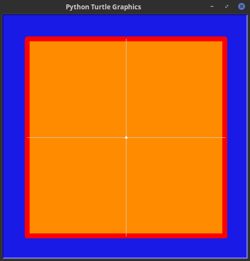
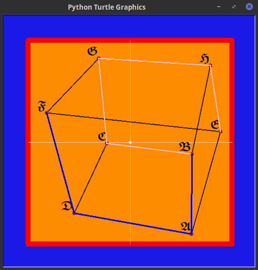

## ℔oom (ha-ɥɐ-ha)
Ⱳℌ℺ is your favorite **T**eenage **M**utant **N**inja **T**urtle ¿ ℑ
don't have one, *Michelangelo* is my favorite painter, but will pick
*Raphael* ‧ ℗ick your one, bcoz in this exercise ve are going to draw ‧
Ŵe are [*given*](https://ioinformatics.org/files/ioi1989problem5.pdf)
a graph vith *n-vertices*, and each vertex (BepTékc, *vex*, ***vtx***) has
***degree** 3*, that is each *vex* has *3* neighbors, or *3* **adjacent**
vertices (*vtes*) ‧ ͳhe problem is subdivided into *4* subsections :

  1. *vtχ* coorz and graph edges are given, and ve hafe to scale them
  appropriately, if necessary, and draw ze graph .
  2. Ħere a definition of *left* and **right** neighbors is given and a
  **ctrlseq**, consisting of initial ***two*** vtes and the letters ℒ
  and ℜ, from which we hafe to figure the corresponding *walk* .
  3. ⅅ*raw* ze walk .
  4. Ȿtarting vtx (**A**), and ending vex (**B**) are given and we have to
  find the minimum *AB-path*, draw it and print the corresponding
  *ctrlseq* .

### Ŧurtle Ninja
**ℱ**or drawing the *Python* ***turtle*** module (requres *Tkinter*) is
used ‧ ℃oordinates are in the range *[-200, 200]* ‧ ℵere is how the
canvas looks like :



₸he program reads from *stdin*, zo infut is placed in a text file and
then redirected ‧ Ⅎormat of the infut is as follows *(infut/cube)* :
```
8

A  120  -180
B  121   -23
C -46   -2
D -110  -139
E  177   21
F -164   58
G -62    165
H  157   151

12

A B
B C
C D
D A
A E
E F
F D
F G
G C
G H
H B
H E

ABLRRL

BF
```
**ℕew lines** and *spaces* are ignored ‧ Ƒirst number is the
*number of vtes*, followed by a list of ***vtx*** data: *(id, x, y)* ‧
𐌔econd number is the *number of edges*, followed by a list of *unordered*
**vtx** pairs: (*id*<sub>0</sub>, *id*<sub>1</sub>) ‧ Ȁnd last two lines
are the *control sequence* and *minimum* path *starting/ending **vtes*** .

### ꞡꞅꜹꝥꜧ.ꝓꝩ < infut/cube

**Ꞗ**asically there is nothing much to be discussed ⏩ for how to use
the *ninja* module there is the online
[*reference*](https://docs.python.org/3.3/library/turtle.html) ‧ ⿰⿱⿳ most
challenging seems to be the fourth sub-problem, but here we use the same
approach as in the first *yoi*
[prob](https://github.com/neznajko/boxes), namely tree ***depth*** srch ‧
┳**his** time I've decided to make a *Screencast*, zo if you don't want
to install additional modules, but are curious to Ꙭ the program, check out
the *video* directory ‧ **ℋ**ere is the final frame ㋡



https://youtu.be/aBGAYLLkgHk
